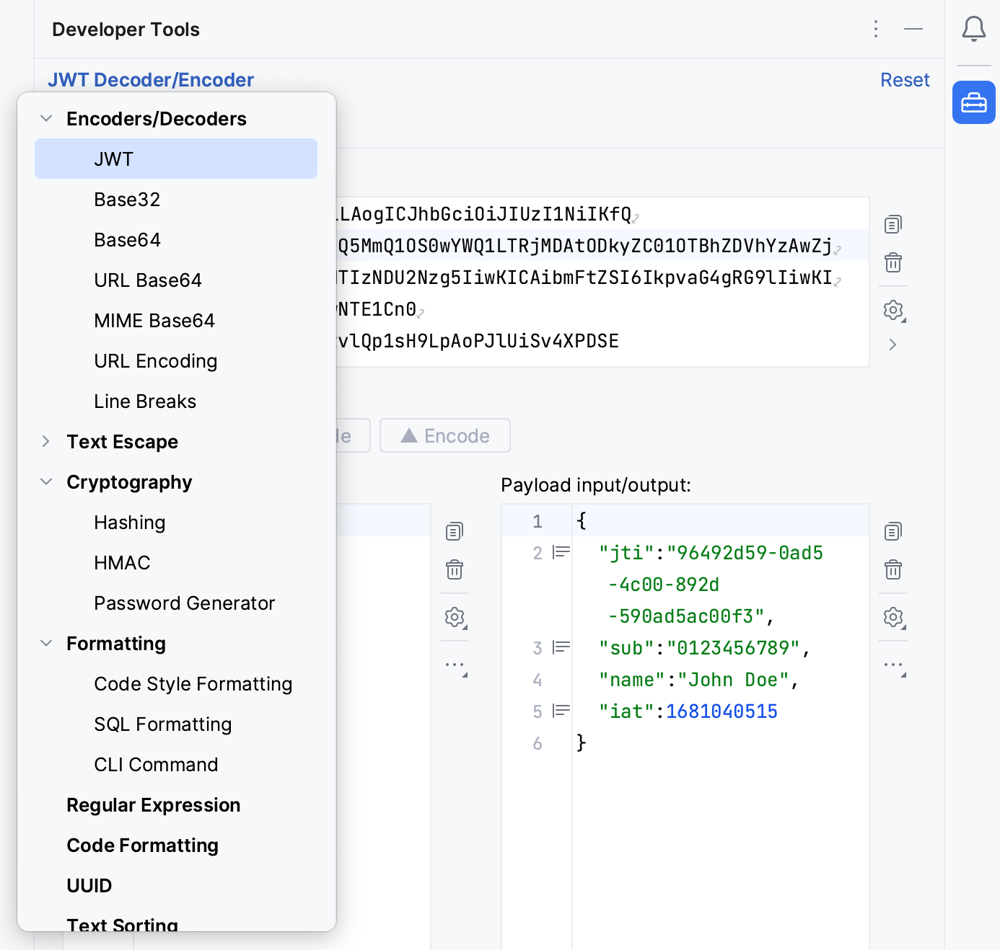
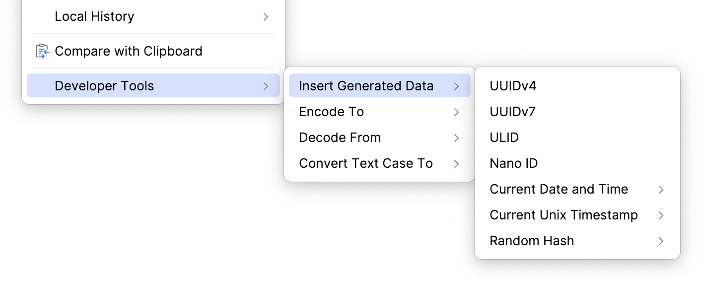

#  开发人员工具插件

这个插件是一套功能强大且用途广泛的工具，旨在增强软件工程师的开发体验。凭借其广泛的功能集合，开发人员可以在不离开编码环境的情况下提高工作效率并简化复杂的作。

主工具栏窗口：

Editor 菜单：

## 主要特点
- 编码和解码：JWT（JSON Web 令牌）、Base32、Base64、URL Base64、MIME Base64、URL 编码和换行符
- 正则表达式匹配器
- UUID、ULID、Nano ID 和密码生成器
- 文本排序
- 文本大小写转换
- 文本差异查看器
- 文本格式转换
- 文本转义：HTML 实体、Java 字符串、JSON、CSV 和 XML
- 文本过滤器
- JSON 路径解析器
- JSON 架构验证器
-散列法
- 存档（ZIP、TAR、JAR、7z 等）查看器和提取器
- 日期时间处理（Unix 时间戳、格式等）
- 时间、数据大小和传输速率的单位转换器
- 代码样式格式
- SQL 格式化
- 颜色选择器
- 服务器证书获取、分析和导出
- 二维码/条形码生成器
- Lorem Ipsum 生成器
- ASCII 艺术

## 集成

主要工具目前作为独立的对话框或工具窗口提供。此外，还可以通过编辑器菜单或代码意图使用一些工具。其中一些工具仅在选择文本或当前插入符号位置位于 Java/Kotlin 字符串或标识符上时可用。

插件设置可以在 IntelliJ 的设置/首选项中 工具 |开发人员工具**。

### 工具窗口

该工具窗口可通过 View |工具窗口 |工具**。工具窗口的所有输入和配置都将存储在工程级别。
### 对话框

访问对话框的作可通过 IntelliJ 的主菜单的 Tools |开发人员工具**。

要将“打开对话框”作添加到主工具栏，我们可以在 IntelliJ 的设置/首选项中启用它 工具 |开发人员工具，或通过 **自定义工具栏... |添加作... |开发人员工具**。

对话框的所有输入和配置都将存储在应用程序级别。

## 开发

插件基于developer tools插件开发